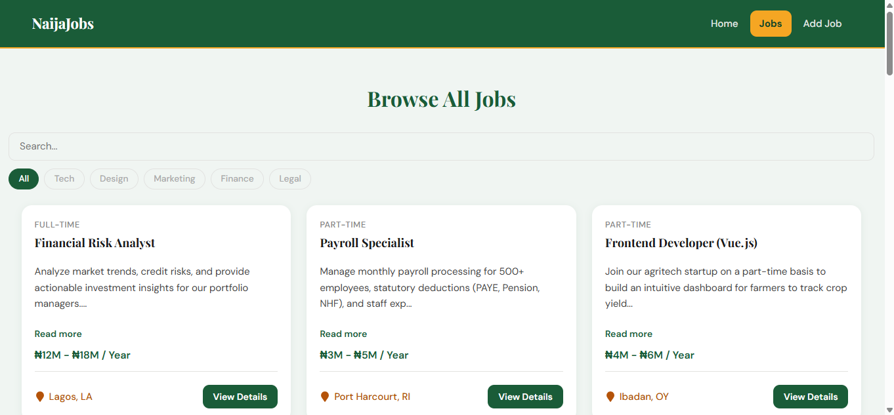
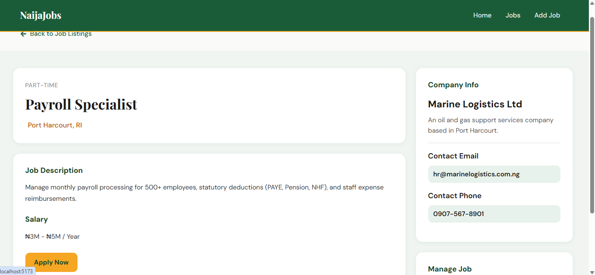

# NaijaJobs 🇳🇬

A responsive job board web application built for the Nigerian job market. Browse, post, edit, and delete job listings — all in a clean, fast single-page experience powered by React and a live REST API.

> 📽️ **Demo Video:** _https://drive.google.com/drive/folders/19P8EMVF2HCrLUmWBO75psbNxWoSgItY8?usp=sharing_
> 
> 📽️ **live link:** _https://threemttjobfe-1.onrender.com_

---

## Features

- Browse all job listings with real-time filtering by category
- View full job details including company info, salary, and contact details
- Post new job listings via a form
- Edit existing listings
- Delete listings with instant UI feedback
- Persistent user preferences via `localStorage`
- Fully responsive — tested on mobile and desktop
- Custom CSS only (no Bootstrap or Tailwind)
- Animated UI elements

---

## Tech Stack

| Layer | Technology |
|---|---|
| Frontend | React 18, Vite |
| Routing | React Router DOM v6 |
| HTTP Client | Axios |
| Icons | React Icons |
| Styling | Vanilla CSS (custom) |
| Backend/API | REST API hosted on Render |

---

## Project Structure

```
src/
├── assets/
│   └── images/          # Logo and static assets
├── components/
│   ├── App.jsx          # Router setup
│   ├── card.jsx         # Job card component
│   ├── dataFetcher.jsx  # Loader functions for React Router
│   ├── Hero.jsx         # Homepage hero section
│   ├── homecard.jsx     # Featured job card for homepage
│   ├── job-listing.jsx  # Jobs list with filtering
│   ├── job-singular.jsx # Single job preview
│   ├── nav.jsx          # Navigation bar
│   ├── not-found.jsx    # 404 error page
│   ├── spinner.jsx      # Loading spinner
│   └── viewAllJobsBtn.jsx
├── layouts/
│   ├── mainlayout.jsx       # Home page layout
│   └── BrowseJobLayout.jsx  # Jobs/detail layout
├── Pages/
│   ├── homePage.jsx     # Landing page
│   ├── jobsPage.jsx     # Single job detail + delete/edit
│   ├── RecentJobs.jsx   # All jobs listing page
│   ├── addJobsPage.jsx  # Add new job form
│   └── editJobs.jsx     # Edit existing job form
└── index.css            # Global styles
```

---

## Getting Started

### Prerequisites

- Node.js v18 or higher
- npm

### Installation

1. **Clone the repository**

   ```bash
   git clone https://github.com/I-webdev/naijajobs.git
   cd naijajobs
   ```

2. **Install dependencies**

   ```bash
   npm install
   ```

3. **Start the development server**

   ```bash
   npm run dev
   ```

4. Open your browser at `http://localhost:5173`

### Build for Production

```bash
npm run build
```

---

## API

The app connects to a live REST API hosted on Render:

```
https://threemttapi-ryoj.onrender.com
```

| Method | Endpoint | Description |
|---|---|---|
| GET | `/` | Fetch all jobs |
| GET | `/:id` | Fetch a single job |
| POST | `/` | Create a new job |
| PUT | `/:id` | Update a job |
| DELETE | `/:id` | Delete a job |

> **Note:** The API is hosted on Render's free tier and may take ~30 seconds to wake up on the first request.

---

## Screenshots





---

## Author

**Temi**  
Built as a capstone project for the 3MTT Software Development programme.
